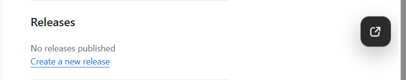

# GitHub Open Links in New Tab

为 GitHub 添加“链接在新标签页打开”的功能，可一键切换 **新标签页 / 当前页** 打开方式，适配 GitHub 动态页面。

[简体中文](#简体中文) | [English](#english)

---

## 简体中文

### ✨ 功能

- 在 GitHub 浏览时，让链接默认在 **新标签页** 中打开（可关闭）
- 右侧提供一个 **悬浮开关**：鼠标悬浮展开，在左侧弹出切换面板
- 适配 GitHub SPA/动态渲染页面（无需遍历重写全部 DOM）
- 设置自动保存，浏览器重启后仍然生效
- 保留浏览器原生行为：**Ctrl/⌘ 点击**仍按浏览器默认逻辑

---

### 🖼️ 预览

- 默认只显示一个图标（把手）
- 鼠标悬浮后向左展开面板进行切换

---

### 🚀 安装方法

1. 安装浏览器扩展 **Tampermonkey**
   - Chrome / Edge / Firefox 都支持
2. 点击下面的安装链接：

> [点击下载](https://update.greasyfork.org/scripts/569262/GitHub%20%E9%93%BE%E6%8E%A5%E6%96%B0%E6%A0%87%E7%AD%BE%E9%A1%B5%E6%89%93%E5%BC%80.user.js)

---

### 🧭 使用说明

- 默认模式：**新标签页打开**
- 右侧边框有一个小图标：
  - 鼠标移上去会展开面板
  - 在下拉框中选择：
    - `🌐 新标签页打开`
    - `📌 当前页打开`

---

### ⚙️ 常见问题（FAQ）

#### 1) Tampermonkey 显示“此脚本未被执行”
- 打开扩展管理
- 找到 Tampermonkey → 点“详细信息”
- 找到“网站访问权限 / Site access”
  - 选“在所有网站上”
  - 或选“在特定网站上”，然后把 `https://github.com/*` 加进去
- 回到 GitHub 页面，强制刷新（Ctrl+F5），再看 Tampermonkey 图标里是否还提示“未被执行”

#### 2) 为什么 Ctrl/⌘ 点击还是原来的行为？
这是刻意保留的：按住 Ctrl/⌘、中键点击等属于浏览器常用操作，不建议脚本篡改。

---

## English

Add an “open links in a new tab” feature to GitHub. You can switch between **New Tab / Same Tab** modes at any time, designed to work well with GitHub’s dynamic (SPA) pages.

### ✨ Features

- Open GitHub links in a new tab by default (toggleable)
- A floating edge toggle on the right side: hover to expand, switch modes in the left popup panel
- Works with GitHub SPA/dynamic navigation (no need to rewrite the whole DOM repeatedly)
- Settings are persisted and survive browser restarts
- Keeps native browser behavior: Ctrl/⌘ click still follows the browser default

---

### 🖼️ Preview

- Shows only a small handle icon by default
- Hover to expand the panel to the left and switch modes

---

### 🚀 Installation

1. Install the **Tampermonkey** browser extension
   - Available for Chrome / Edge / Firefox

2. Click the link below to install:

> [Download from GreasyFork](https://update.greasyfork.org/scripts/569262/GitHub%20%E9%93%BE%E6%8E%A5%E6%96%B0%E6%A0%87%E7%AD%BE%E9%A1%B5%E6%89%93%E5%BC%80.user.js)

---

### 🧭 Usage

- Default mode: **Open in New Tab**
- A small icon appears on the right edge of the page:
  - Hover over it to expand the panel
  - Use the dropdown to choose:
    - `🌐 Open in new tab`
    - `📌 Open in same tab`

---

### ⚙️ FAQ

#### 1) Tampermonkey says “This script has not been executed”

This usually means Tampermonkey is not allowed to run on `github.com`.

- Open the extensions page
- Find Tampermonkey → open Details
- Find “Site access”
  - Choose “On all sites”
  - Or choose “On specific sites” and add `https://github.com/*`
- Go back to GitHub and hard refresh (Ctrl+F5), then check again

#### 2) Why does Ctrl/⌘ click still behave normally?

This is intentional. Ctrl/⌘ click, middle-click, etc. are common browser actions and should remain unchanged.
